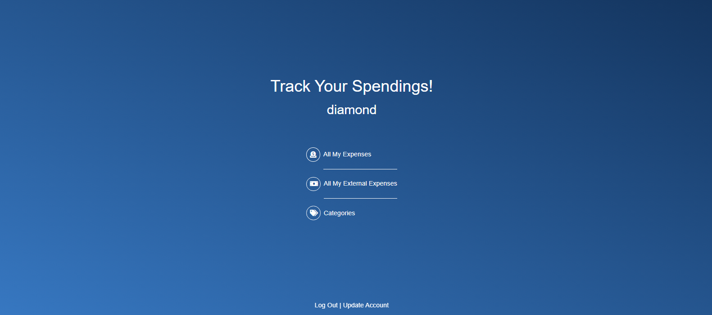

# Cash_app

> Cash_app is an app developed to help you keep track of your spendings!.

On your first access you will create your account.
From there you will visit your profile and see 3 links:

- All my expenses.
  Here you can see all your categorized expenses and have a button to add new expenses.
  You can also click on the expense and go to that expense page where you can.
    - Edit this expense.
    - Delete this expenses.
    - Add a category to this expense.
    - Remove a category from this expense.
  Obs.: All newly added expenses don't have a category.

- All my external expenses.
  Here you can see all your uncategorized expenses and have a button to add new expenses.
  You can also click on the expense and go to that expense page where you can.
    - Edit this expense.
    - Delete this expenses.
    - Add a category to this expense.
    - Remove a category from this expense.
  Obs.: All newly added expenses don't have a category.

- All categories.
  Here you can see all your categories and have a button to add new categories.
  You can also click on the category and go to that category page where you can.
    - Edit this category.
    - Delete this category.
  Obs.: The icon has to be added as an URL to an image.

## Built With

- Ruby 2.7.2
- Rails 6
- Styled with:
  - Bootstrap 5.0
- Authentication with:
  - Devise
- Tested with:
  - Rspec
  - Capybara
- Database with:
  - PostgreSQL 13

## Live Demo

[Cash_app Live!]()

## Getting Started

To get a local copy up and running follow these simple example steps.

### Prerequisites

- Ruby 2.7.2
- Rails 6
- Yarn
- PostgreSQL

### Setup

- On the top of this repo click on the button named "Clone"
- Copy the HTTP URL or SSH.
- On the terminal type `git clone <copied-value>` where <copied-value> is the value you copied on the previous step.
- On the terminal `cd` to the folder you cloned.

### Install

- Open the file 'database.yml' on the folder 'config'
- On development: and on test: change the values of username: and password: to the username and password of your local postgres server.
- On the terminal type `rails db:create`.
- On the terminal type `rails db:migrate`.

### Usage

- On the terminal type `rails s`
- On the browser type `localhost:3000`

### Run tests

- On the terminal `cd` to the folder you just cloned.
- On the terminal type `rspec`.

## Authors

👤 **Diamond Nicholas**

- GitHub: [diamond-nicholas](https://github.com/diamond-nicholas)
- Twitter: [@diamondnich](https://twitter.com/diamondnich)
- LinkedIn: [diamond-nicholas](linkedin.com/in/diamond-nicholas/)

## 🤝 Contributing

Contributions, issues, and feature requests are welcome!

Feel free to check the [issues page](https://github.com/diamond-nicholas/cash_app/issues).

## Show your support

Give a ⭐️ if you like this project!

## Acknowledgments

- Design idea by [Gregoire Vella on Behance](https://www.behance.net/gallery/19759151/Snapscan-iOs-design-and-branding?tracking_source=)
